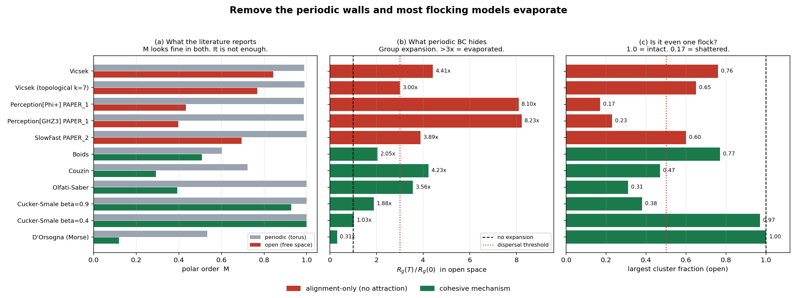

# open-collective

A codebase for **formation, flocking, and group consensus models where the boundary
condition is a first-class, swappable object** — so you can test whether a model
survives when you delete the periodic walls.

## The problem this exists to solve

Almost the entire flocking literature simulates on a **periodic torus**. Vicsek
(1995), Grégoire–Chaté, and both Beuria papers in this project do it:

- `PAPER_1`: N=200 agents in a 2D periodic box of L=10
- `PAPER_2`: "N active agents moving in a two-dimensional **periodic** domain"

A periodic box quietly does two things that rescue a model:

1. It **pins the density** at ρ = N/L^d forever.
2. It **guarantees neighbours**, because the domain has no outside to escape into.

An alignment-only model has no attractive term. Its only interaction is "rotate my
heading toward my neighbours' mean heading." On a torus that is enough to produce a
beautiful order–disorder transition. In open space it is **not enough**: the group
spreads, neighbour lists empty, the interaction switches off, and the flock
shatters into fragments that each order independently. The global polar order
parameter then reports a number that means nothing.

**Neither Beuria paper contains an attraction term. Both should therefore evaporate
in open space. They do.**

## Headline result (measured, `experiments/exp1_boundary_collapse.py`)

Identical initial conditions. Same N, same density, same headings. The **only**
difference is the topology.

| model | M (periodic) | M (open) | R_g growth | fragments | largest cluster | verdict |
|---|---|---|---|---|---|---|
| Vicsek * | 0.989 | 0.843 | 4.41× | 3.0 | 0.76 | PARTIAL |
| Vicsek (topological k=7) * | 0.990 | 0.768 | 3.00× | 6.0 | 0.65 | PARTIAL |
| **Perception[Φ+] — PAPER_1** * | **0.987** | 0.434 | **8.10×** | **39.0** | **0.17** | **EVAPORATED** |
| **Perception[GHZ3] — PAPER_1** * | **0.987** | 0.397 | **8.23×** | **42.5** | **0.23** | **EVAPORATED** |
| **SlowFast — PAPER_2** * | **1.000** | 0.695 | 3.89× | **18.5** | 0.60 | PARTIAL |
| Boids | 0.602 | 0.508 | 2.05× | 3.0 | 0.77 | PARTIAL |
| Couzin | 0.723 | 0.293 | 4.23× | 5.0 | 0.47 | EVAPORATED |
| Olfati-Saber | 0.999 | 0.393 | 3.56× | 17.0 | 0.31 | EVAPORATED |
| Cucker-Smale β=0.9 | 1.000 | 0.927 | 1.88× | 40.5 | 0.38 | EVAPORATED |
| **Cucker-Smale β=0.4** | 1.000 | **1.000** | **1.03×** | 3.0 | **0.97** | **SURVIVES** |
| **D'Orsogna (catastrophic)** | 0.534 | 0.119 | **0.31×** | **1.0** | **1.00** | **SURVIVES** |

`*` = alignment-only (no attraction term). `R_g growth` = R_g(T)/R_g(0) in open space.

### Read this table three ways

1. **M is a liar.** Vicsek reports M=0.843 in open space — that looks like a
   healthy flock. It has actually split into 3 pieces. M is averaging over groups
   that cannot see each other. *Never report M without reporting fragmentation.*
2. **PAPER_1 is the worst performer in the study.** M=0.987 on the torus →
   **39 fragments, 17% largest cluster** in open space. The vision cone
   (α=π/2, r∈[0.1, 5]) makes it *more* fragile than plain Vicsek, because a
   forward-only cone means an agent that falls behind can never recover contact.
3. **PAPER_2's fixed graph hides the failure.** Its `w_ij = 1/n` topological
   neighbourhood is *frozen at t=0*, so the model **believes** it is connected
   while the flock physically shatters into 18.5 pieces. Set
   `fixed_graph=False` to see it honestly.



### What actually works, and why

Only two mechanisms survive open space, and **neither is "better alignment"**:

- **Cucker–Smale with β ≤ 1/2.** ψ(r) = K/(σ²+r²)^β never reaches zero, so
  agents can never fully lose contact. The theorem is *unconditional*: flocking
  for **any** initial condition in unbounded R^d. Measured R_g growth **1.03×** —
  the group does not expand at all. At β=0.9 (outside the theorem) the same model
  shatters into 40 fragments. **The β=1/2 threshold is visible in the simulation.**
- **D'Orsogna with a genuine attractive potential.** Morse attraction pulls the
  group into a bounded blob. Measured growth **0.31×** — it *contracts*.

### A subtlety worth the price of admission

D'Orsogna's **H-stable** regime (C·l² > 1) **disperses** (6.2×, 60 fragments).
Its cohesive mills and flocks live in the **catastrophic** regime (C·l² < 1).
Same model, opposite fate, decided entirely by (Ca, la, Cr, lr).

> **Cohesion is a parameter-regime property, not a property of a model's name.**

## Groups, 3D, and drones — see [RESEARCH.md](RESEARCH.md)

Three things extend the argument above; the full write-up with every measured table is in
**[RESEARCH.md](RESEARCH.md)**.

**1. Cohesion is not the whole question.** Several groups sharing one airspace can fail a
second, independent way: they **fuse**. Every cohesion metric on this page reports a
*perfect score* while it happens — measured, segregation index 1.00 → 0.50 with
`largest_cluster_frac` = 1.00, `frag` = 1, integrity = 1.00. The groups lost no members;
they lost only the thing that made them groups. `models/grouping.py::MultiGroupFlock`
maintains K groups in open space (in-group Cucker-Smale + out-group segregation), and
`experiments/exp2_grouping.py` measures both failure directions.

**2. You can watch it.** `core/viz3d.py` renders any model in 3D with the live metrics
burned into the frame, so the picture and the numbers cannot drift apart:

```bash
python experiments/viz3d_demo.py --scene collapse    # Vicsek: torus vs open space
python experiments/viz3d_demo.py --scene fusion      # groups merge while 'largest'=1.00
```

**3. It matters to real hardware.** `Uav/swarm_sim.py` computes `cs_weight = 1.0/(1.0+d**2)`
and calls it "Cucker-Smale-style". That is psi(r) at **beta = 1** — outside the beta <= 1/2
regime the theorem needs — and it is then normalised, which makes it a DeGroot average the
theorem does not describe at any beta. It works anyway, **for a reason its comment does not
name**. The trap is the obvious fix: unnormalising it into a "real" Cucker-Smale sum while
leaving beta=1 loses drones (31x team expansion; a displaced drone at 1.4 km and still
departing). Half-adopting the theory is much worse than ignoring it.

## Install & run

> **Not technical? The easy button:** run `python3 start.py` (Windows:
> `python start.py`), or double-click `start.command` (Mac) / `start.sh` (Linux)
> / `start.bat` (Windows). It builds its own workspace, installs everything the
> app needs, and opens the app. For a picture instead, run `python3 example.py`
> → `flock.png`.
>
> New to the project? Follow the step-by-step, beginner-friendly
> **[Getting Started guide](docs/GETTING_STARTED.md)** (Linux/macOS/Windows).
> The developer quick version is below.

```bash
pip install numpy scipy matplotlib pillow

python tests/test_theorems.py                      # 13/13 theorem checks
python experiments/exp1_boundary_collapse.py       # the headline table
python experiments/exp1_results.py                 # table + figure
python experiments/exp2_grouping.py                # group maintenance (RESEARCH.md S3)
python experiments/viz3d_demo.py                   # 3D movies (RESEARCH.md S4)
python Uav/run_multi_team.py                       # multi-team UAV (RESEARCH.md S5)
python experiments/demo_new_features.py            # init methods, new metrics, Kuramoto, manager
```

## Interactive GUI

A PySide6 front end drives the same headless engine live — real-time parameter
control, play/pause/step/reset, zoom/pan, and on-canvas trajectories, vision
cones, and neighbour links, with every measurement read out per frame. The
physics is unchanged: every step goes through `CollectiveModel.step` and every
number through `core.metrics`, so what you see is what the batch experiments
compute.

```bash
pip install PySide6
python run_gui.py                                  # or:  python -m gui
python tests/test_gui_smoke.py                     # headless (offscreen) check + screenshot
```

The right-hand panel builds a **live slider for every numeric constructor
argument** of the selected model (introspected from its `__init__`), so all ten
free-running models — Vicsek, Kuramoto, Boids, Couzin, Cucker–Smale, D'Orsogna,
Olfati-Saber, Perception (PAPER_1), SlowFast (PAPER_2), Multi-group — are
tunable without touching code. Structural choices (model, boundary, N, groups,
initializer) rebuild the run; parameter sliders apply to the running model.

> Platform status, setup notes, and the change log live in
> **[BIRDFLOCKLAB.md](BIRDFLOCKLAB.md)** — the running documentation for the
> BirdFlockLab build-out on top of this engine.

## Layout

```
core/
  boundary.py    Periodic / Open / Reflecting. THE central abstraction.
  neighbors.py   metric, topological (k-NN), vision-cone (PAPER_1 geometry)
  metrics.py     order, cohesion AND group-maintenance diagnostics
                 (+ density, heading_entropy, mean_speed)
  base.py        State, CollectiveModel, run()
  init.py        initializers: random / cluster / ring / grid / manual / CSV
  viz3d.py       3D rendering: boundary-aware, metrics in-frame
models/
  alignment.py   Vicsek, PerceptionQuantum (PAPER_1), SlowFastPerception (PAPER_2),
                 Kuramoto
  cohesive.py    Boids, Couzin, D'Orsogna, Cucker-Smale, Olfati-Saber
  grouping.py    MultiGroupFlock -- K groups that stay distinct in open space
  formation.py   Displacement, Distance/rigid, Leader-follower, Cyclic pursuit
  consensus.py   DeGroot, Friedkin-Johnsen, SignedFJ, Altafini, GroupConsensus
experiments/
  manager.py     registry + config (JSON/YAML) + CSV/HDF5 export + parameter sweep
gui/
  canvas.py      QPainter renderer: agents, trails, vision cones, neighbour links
  main_window.py controls, introspected live sliders, transport, live metrics
  app.py         entry point (python run_gui.py / python -m gui)
Uav/
  swarm_sim.py     the original 2D single-team drone sim
  multi_team_3d.py K teams, 3D, open airspace, leader-loss + turbulence
```

Every model obtains separations via `boundary.displacement()` and nothing else.
That single discipline is what makes the periodic/open swap valid.

Each model carries an honest `cohesive` flag: does it contain a mechanism that can
hold the group together **without help from periodic walls**?

## The bridge to Tripathy & Shrinate (validated in code)

`tests/test_theorems.py::test_beuria_phi_minus_is_a_signed_network` proves the
connection from the previous discussion:

PAPER_1 Eq. 32 gives, for the Φ⁻ state:

```
p_i(t+1) = p_i + κ[ −(1/2)(p_i1 + p_i2) + η e_i ]
```

Every neighbour enters with a **minus sign**. As a signed graph, that is the
**all-negative complete graph**. Structural balance theory says such a graph on
n > 2 vertices is **unbalanced** (every triangle has three negative edges — an odd
number). **Altafini's theorem** then predicts collapse to zero — which is exactly
the disorder Beuria reports numerically, *but now with a reason and a proof*.

Measured: unbalanced → |x| → 5.8e-22. Collapse, as predicted.

**And here is the regime PAPER_1 never tested.** Make the signed perception state
*balanced* (3 neighbours positive, 3 negative) and you do **not** get disorder —
you get **bipartite consensus**: two counter-propagating sub-flocks at +c and −c,
with the camps matching the structural-balance gauge partition exactly.

```
final x = [-0.0154 -0.0154 -0.0154  +0.0154 +0.0154 +0.0154]
```

PAPER_1 only ever tests the all-negative case and concludes "negative coefficients
destroy cohesion." That conclusion is **too strong**. The correct statement is:

> Negative perceptual coefficients destroy cohesion **iff the induced signed
> perception graph is structurally unbalanced.** When it is balanced, they produce
> two counter-propagating sub-flocks instead.

That is a **new, falsifiable prediction** the paper could have made and didn't —
and it is Shrinate & Tripathy's machinery that supplies it.

## Three papers sitting in this repo

1. **"Open-boundary collapse of perceptual flocking models."** Table above.
   PAPER_1 loses 83% of its flock the moment you delete the walls. Fix: add a
   Cucker–Smale weight ψ(r) to the perception operator's off-diagonal terms — the
   operator is already a weighted adjacency matrix (PAPER_1 says so explicitly),
   so the ψ(r) weight drops straight in and imports the unconditional flocking
   theorem for free.
2. **"Structural balance of perceptual decision states."** The bridge above.
   Turns a numerical observation into a theorem with a novel prediction.
3. **"PAPER_2 is a Friedkin–Johnsen model with dynamic stubbornness."** Its slow
   register `s_i` biases how strongly agent i follows neighbours — exactly the job
   of the FJ stubbornness β_i, except dynamic and self-generated. Run
   `models/consensus.py::FriedkinJohnsen` against `SlowFastPerception` and ask
   whether Shrinate–Tripathy's multiconsensus conditions predict PAPER_2's
   hysteresis regime.

## Caveats

- 2D only in the plotting/mill diagnostics; the core is d-dimensional.
- Results above: N=120, L=10, 1500 steps, dt=0.05, 2 seeds. Enough to establish
  ordering, not for finite-size scaling. Increase `SEEDS` and `N` before quoting.
- Boids/Couzin/Olfati-Saber fail here partly because their **finite-range**
  attraction cannot recover a group that starts spread over L=10. That is honest
  physics — finite-range cohesion needs initial connectivity — but it means their
  numbers are a statement about this initial condition, not a verdict on the models.
  Start them from a tight blob and they hold. Cucker–Smale needs no such excuse.
